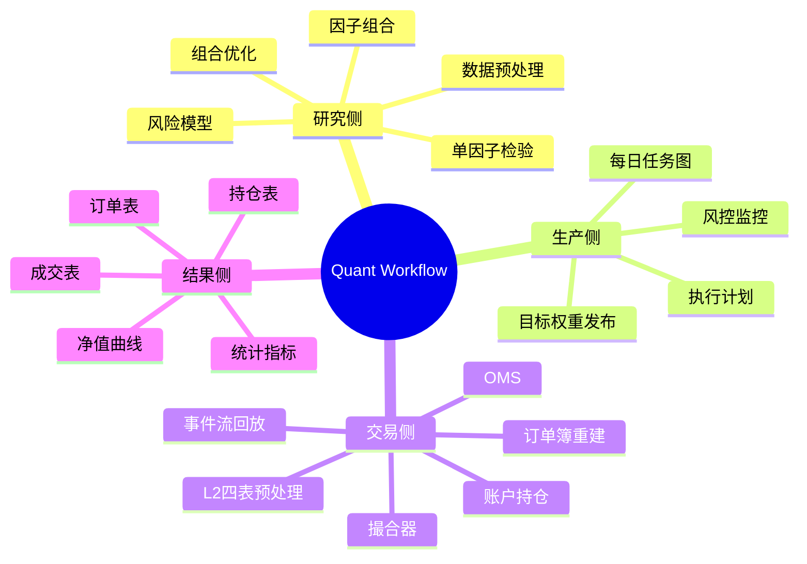
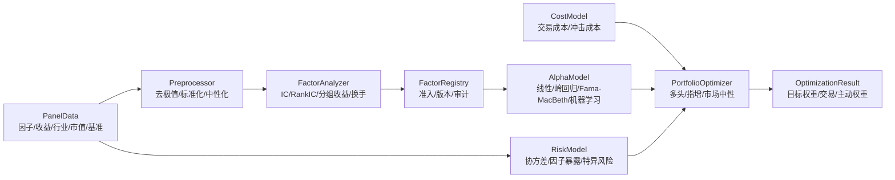
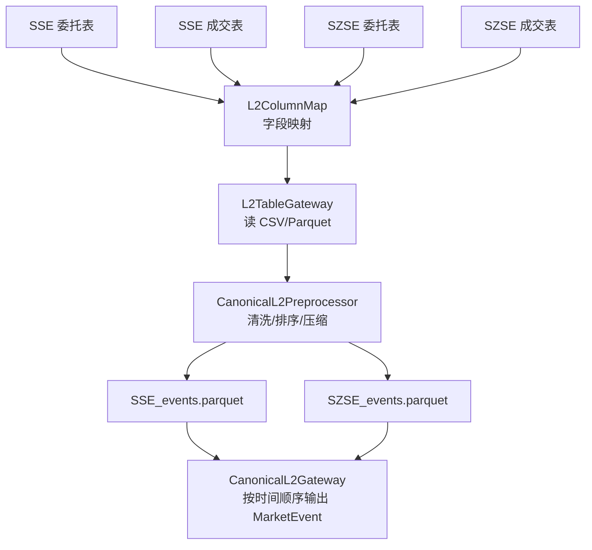
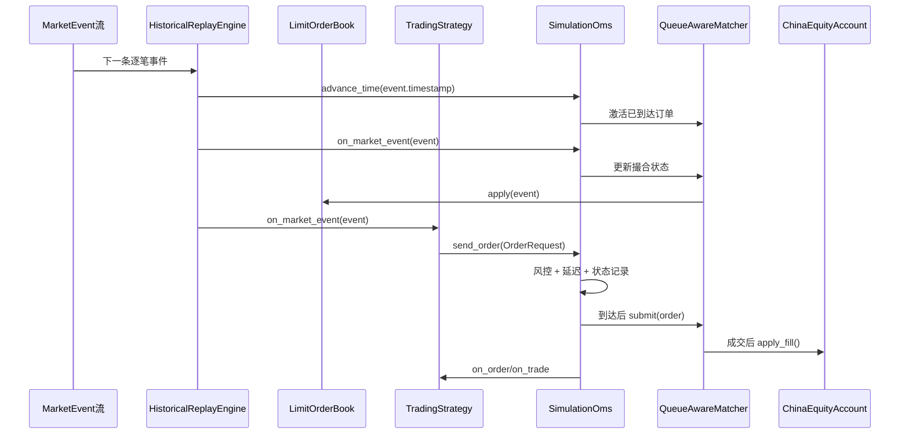
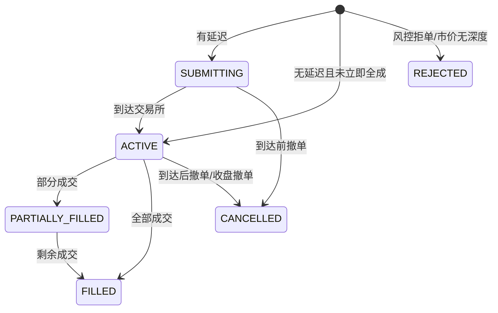

# 项目事件流思维导图

这份图是给学习代码用的。你可以先看“总览”，再沿着“研究侧 -> 组合权重 -> 交易侧 -> 监控反馈”的路径读代码。

## 总览



## 从单因子到权重



## 指数增强权重逻辑

指数增强不是简单做多高分股，而是：

```text
最终权重 w = 基准权重 b + 主动权重 a
```

其中：

- `b` 是指数成分股权重；
- `a` 是因子模型给出的主动偏离；
- 看空的因子不一定意味着卖空，而是在股票只能做多时形成“低配/剔除”作用；
- 对公募指增或严格成分股内增强，非成分股默认不能进入组合。

## L2 四表到事件流



## 交易回测主链路



## 限价单后续状态



## 文件学习路径

建议按下面顺序阅读：

1. `trading/events.py`：所有事件和订单状态的数据结构；
2. `trading/data.py`：原始四表如何读入并变成标准事件；
3. `trading/l2_preprocess.py`：如何离线预处理为可复用事件流；
4. `trading/book.py`：如何从逐笔委托/成交重建订单簿；
5. `trading/oms.py`：订单生命周期、延迟、风控和成交回报；
6. `trading/matching.py`：限价单 taker/maker 撮合逻辑；
7. `trading/account.py`：现金、费用、T+1 和持仓；
8. `trading/engine.py`：历史回放和模拟盘如何驱动整条链；
9. `trading/integration.py`：组合权重如何接入交易回测；
10. `tests/test_trading_engine.py`：用小样本验证上述逻辑。

## 关键理解

- `LimitOrderBook` 不是最终节点，它只是“当前盘口状态”；
- 真正的订单生命周期在 `SimulationOms` 和 `QueueAwareMatcher`；
- 限价单要么到达时主动成交，要么挂入队列等待后续逐笔成交；
- 回测结果不是只看订单簿，而是看 `ReplayResult.orders`、`ReplayResult.trades`、`ReplayResult.equity_curve` 和 `ReplayResult.positions`。
