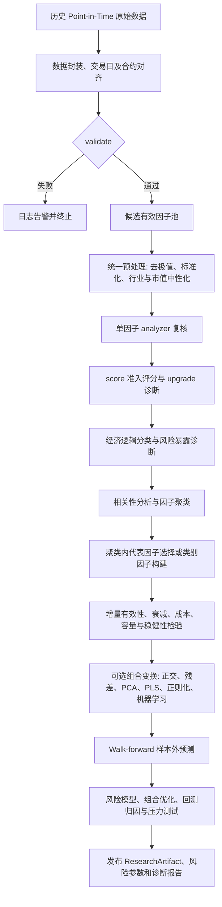
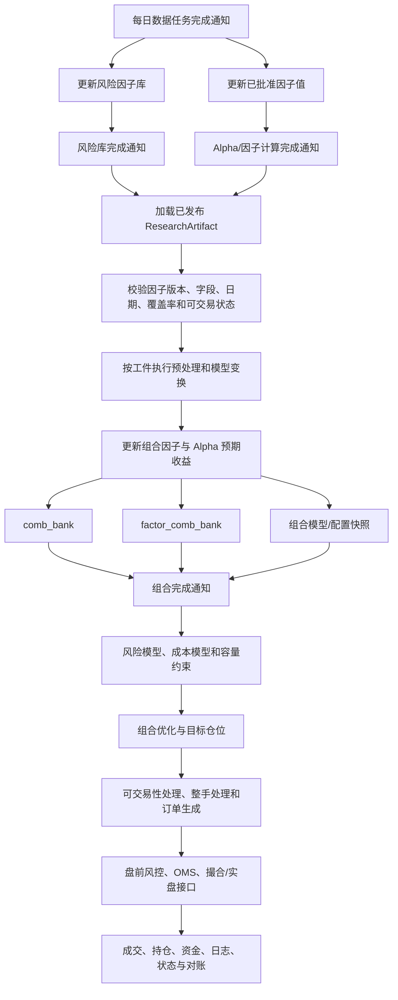

# 研究侧与每日生产侧边界

## 两个入口

- 研究侧：`researchflow.FactorResearchWorkflow.run()`
- 每日生产侧：`quant_workflow.DailyProductionWorkflow.run()`

研究员先在历史 Point-in-Time 数据上完成因子准入、聚类、增量检验、模型选择和
压力测试，发布不可变的 `ResearchArtifact`。每日生产只读取这个工件和当日数据，
不重新做因子准入或聚类。

## 研究侧

强制顺序：

1. 单因子复核和聚类读取统一预处理后的原语义因子。
2. 正交化、残差化、PCA 和 PLS 只能在聚类与代表因子选择之后运行。
3. 残差 IC 可以用于“新增因子是否有增量价值”的检验，但不能替代聚类输入。

## 每日生产侧

修改图对应的依赖原则：

- 上游数据与风险库完成后才能进入 Alpha/因子计算。
- 组合因子更新必须由 Alpha/因子完成通知触发。
- `comb_bank`、`factor_comb_bank` 和组合模型更新是并列产物，共同汇入组合完成通知。
- 组合完成通知只能向下游组合、订单和交易链传播，不能反向触发因子或风险库更新。
- 上交所与深交所委托、成交数据分别标准化后，统一进入规范事件流和回放/执行引擎。

## 工件职责

`ResearchArtifact` 固化：

- 获准因子清单和版本标识
- 聚类归属与代表因子
- 预处理和可选模型变换配置
- 因子组合与 Alpha 模型配置
- 风险模型与组合优化配置
- 研究诊断元数据

生产侧发现获准因子缺失时立即失败，不自动删因子、补因子或重新聚类。

## 多策略并行

`DailyProductionWorkflow.run_strategies()` 只计算一次已批准因子、Alpha 预期收益和
统一风险模型，然后把同一快照交给三类独立优化器：

- `LONG_ONLY`：权重和为 1、个股非负，并支持个股、风险暴露、换手和 ADV 约束。
- `INDEX_ENHANCED`：加载指数底仓，求主动权重，最终权重等于底仓加主动权重；
  主动权重和为 0，并支持单票主动偏离、跟踪误差和主动风险暴露约束。
- `MARKET_NEUTRAL`：支持净敞口、毛敞口、个股多空上限、风险暴露、换手和 ADV
  约束。

三条分支的目标函数都包含 Alpha 收益、股票协方差风险、线性费用/价差、卖出税费、
非线性市场冲击和可选换手惩罚。

市场中性实盘仍需外部提供并接入：可融券池、逐券借券额度与费率、券源召回规则，
以及股指期货合约、基差、保证金和展期配置。当前数学优化器允许负权重，但不会假设
这些真实交易资源天然存在。
