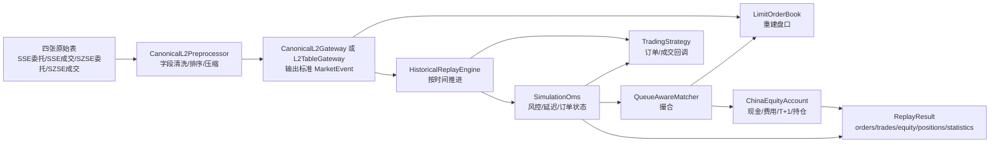
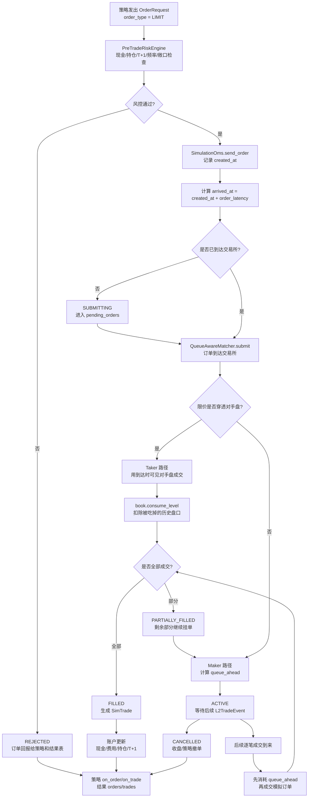

# 逐笔回测与模拟盘架构

本模块参考 vn.py 的事件驱动思想，但没有直接沿用 vn.py 的 bar/tick 成交假设。A 股逐笔委托/逐笔成交回测的核心不是“看到盘口就成交”，而是：

1. 用上交所、深交所的逐笔委托和逐笔成交表重建事件流；
2. 按事件时间推进内存订单簿 `LimitOrderBook`；
3. 策略下单后经过延迟 `order_latency` 才到达交易所；
4. 到达时再判断该限价单是 taker 立即成交，还是 maker 入队等待后续成交；
5. 每一次成交、拒单、撤单都会回到 OMS、账户、策略和结果表。

## 总事件流



## “限价单后面为什么没有了？”

图里如果只画到“限价单/LimitOrderBook”，会让人误以为流程断在这里。实际代码不是这样，`OrderType.LIMIT` 之后分成两条路径：



对应代码位置：

- `trading/oms.py::SimulationOms.send_order()`：创建订单、做风控、计算到达时间；
- `trading/oms.py::SimulationOms.advance_time()`：市场时间推进时，把已经到达交易所的订单激活；
- `trading/matching.py::QueueAwareMatcher.submit()`：订单到达后进入撮合器；
- `trading/matching.py::_cross_immediately()`：限价单如果穿透对手盘，按到达时可见深度立即成交；
- `trading/matching.py::_match_passive()`：限价挂单等待后续逐笔成交，先扣 `queue_ahead`，再成交自己；
- `trading/book.py::LimitOrderBook.consume_level()`：主动成交后扣掉历史盘口，防止多个模拟订单重复吃同一笔流动性；
- `trading/oms.py::_on_fill()`：生成 `SimTrade`，更新账户，回调策略；
- `trading/engine.py::_on_order()`、`_on_trade()`：写入结果表。

## Taker 与 Maker 的判断

买入限价单：

- 若 `limit_price >= best_ask`，视为主动吃卖盘；
- 若 `limit_price < best_ask` 或当时没有可成交卖盘，视为挂买单排队。

卖出限价单：

- 若 `limit_price <= best_bid`，视为主动打买盘；
- 若 `limit_price > best_bid` 或当时没有可成交买盘，视为挂卖单排队。

注意：判断发生在订单到达交易所的时间点，不是策略发单时间点。延迟期间所有逐笔委托、撤单、成交都会继续更新订单簿。

## 为什么不预先生成全量盘口快照

不建议把每一条逐笔事件都展开成全量快照文件。盘口大部分字段在相邻事件之间不变，持久化全量快照会制造大量重复数据。

本项目采用：

1. 离线阶段只清洗、排序和压缩事件流；
2. 回测阶段顺序读取事件；
3. `LimitOrderBook` 在内存中增量维护当前盘口；
4. 策略和撮合器需要盘口时，从当前订单簿读取买一卖一或多档深度。

这样更接近真实交易时序，也避免数据膨胀。

## 延迟时序

```text
策略观察市场事件 t0
策略发单 send_time = t0
订单到达交易所 arrival_time = send_time + order_latency
t0 到 arrival_time 之间的逐笔事件继续更新 LimitOrderBook
arrival_time 到达后才判断 taker/maker
```

当前实现使用固定 `order_latency`，适合做确定性基线。更高精度的 T0/高频研究，应进一步拆分：

- 行情接收延迟；
- 策略计算延迟；
- 柜台/网关延迟；
- 交易所回报延迟；
- 撤单延迟；
- 延迟抖动分布。

## 当前边界

这套回测已经覆盖逐笔事件流、限价单 taker/maker、队列位置、部分成交、撤单、费用、T+1 和结果汇总。接真实资金前仍需要补齐：

- 用真实四表样本校准字段字典、交易所序号和集合竞价规则；
- 用真实成交回报校准 `queue_join_ratio` 和延迟分布；
- 引入真实柜台订单回报、断线重连、重复回报去重；
- 完整恢复 OMS、账户、冻结资金、冻结持仓和策略状态；
- 做长周期实盘影子盘、压力测试和灾备演练。
