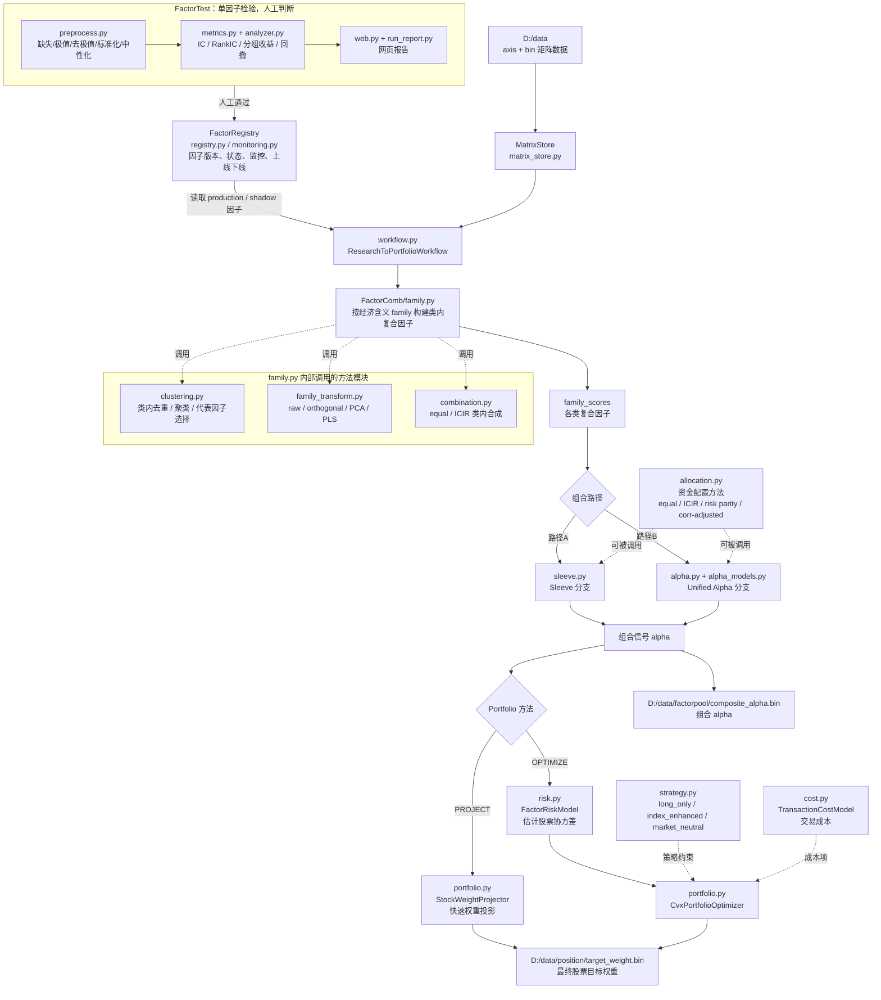

# ResearchFlow v2 结构说明

v2 是按“单因子检验 -> 因子治理 -> 多因子组合 -> 股票权重”的主链路重写的版本，不依赖、不 import v1。当前代码强调矩阵化数据结构、模块职责清晰、主流程只做编排，具体模型方法放在各自模块里。

## 1. 当前主流程



主干可以简化理解为：

```text
FactorTest 单因子报告
    ↓ 人工通过
FactorRegistry 因子入库/状态管理
    ↓ workflow 读取 production / shadow 因子
FactorComb.family 类内去重、变换、复合
    ↓
Sleeve 分支 或 Unified Alpha 分支
    ↓
Portfolio.Project 或 Portfolio.Optimize
    ↓
最终股票权重 target_weight.bin
```

## 2. 模块边界

`FactorTest`：单因子人工检验。负责网页报告、缺失/极值检查、去极值、横截面标准化、行业市值中性化、IC/RankIC/分组收益等。这里是研究员人工判断入口，不自动进入组合。

`FactorRegistry`：因子生命周期治理。负责因子版本、family、owner、状态、路径、监控快照、上线/下线记录。状态包括 `research`、`candidate`、`shadow`、`production`、`retired`。

`FactorComb`：多因子组合层。负责从已入库因子生成 family composite、统一 alpha 或 sleeve 信号，不处理最终股票约束和股票持仓权重。

`Portfolio`：股票权重层。负责把 alpha/sleeve 输出转成股票目标权重，并处理策略约束、风险、交易成本、换手、ADV、行业约束等。

`workflow.py`：顶层编排。串联 `FactorRegistry -> FactorComb -> Portfolio`，自己不放具体模型算法。

`matrix_store.py`：生产侧矩阵 I/O，读取/写入 `D:/data` 下的 axis + bin 文件。

`matrix_math.py`：底层公共数学函数库，不是业务流程节点。供各模块调用，如 winsorize、zscore、中性化、IC/RankIC、分组收益、权重 cap、PSD 修复等。

## 3. FactorComb：多因子组合层

`family.py` 是类内组合控制器，不是和 `clustering.py`、`family_transform.py`、`combination.py` 并列的顺序脚本。它在每个 family 内调用这些方法模块，生成类内复合因子。

| 文件 | 职责 |
| --- | --- |
| `family.py` | 按 family 分组，调用去重、代表因子选择、类内变换、解释力复检和类内复合 |
| `clustering.py` | greedy 去重、hierarchical 聚类、代表因子选择 |
| `family_transform.py` | 统一承载 `raw / orthogonal / PCA / PLS`，返回 `FamilyTransformResult` |
| `combination.py` | 类内通用组合方法，如 equal、ICIR |
| `sleeve.py` | 路径 A：每个因子类生成 sleeve，再做 sleeve 资金配置 |
| `alpha.py` | 路径 B：各因子类复合为统一 alpha |
| `alpha_models.py` | ridge、Fama-MacBeth、score slope、sklearn 系列等 alpha 模型 |
| `allocation.py` | 可复用资金配置方法：equal、ICIR、risk parity、correlation-adjusted |

FactorComb 不包含股票权重、交易成本、风险模型、组合优化器，这些都放在 `Portfolio`。

## 4. Portfolio：股票权重层

Portfolio 只处理“组合信号如何变成股票目标权重”。

| 文件 | 当前职责 |
| --- | --- |
| `portfolio.py` | `StockWeightProjector` 快速投影；`CvxPortfolioOptimizer` 按天做 convex 优化 |
| `strategy.py` | long-only、指数增强、市场中性三类策略约束封装 |
| `risk.py` | `FactorRiskModel`：因子收益、因子协方差、特异风险、股票协方差 |
| `cost.py` | `TransactionCostModel`：线性交易成本和冲击成本；`HoldingCostModel` 预留 |
| `regime.py` | 状态概率、权重 tilt、专家混合，当前未接入主 workflow |
| `stress.py` | 组合压力测试、情景冲击，当前未接入主 workflow |

说明：当前 `portfolio.py` 顶部直接 import `cvxpy`，所以使用 `ResearchFlow.Portfolio` 时环境需要有 `cvxpy`。如果之后希望 `PROJECT` 路径完全不依赖 `cvxpy`，可以再把 `cvxpy` 改成优化器内部 lazy import。

## 5. 从单因子到最终持仓的运行顺序

1. `FactorTest` 做单因子检验和网页报告。
2. 研究员人工判断因子是否进入候选、模拟盘观察、上线或下线。
3. `FactorRegistry` 登记因子版本、family、owner、路径和状态。
4. `ResearchToPortfolioWorkflow` 读取 registry 中的 `production` 和 `shadow` 因子。
5. `FactorComb/family.py` 在每个 family 内做去重、代表因子选择、`raw / orthogonal / PCA / PLS` 类内变换、解释力复检和类内复合。
6. 选择组合分支：
   - `PortfolioRoute.SLEEVE`：走 `FactorComb/sleeve.py`，得到 sleeve 合成信号。
   - `PortfolioRoute.UNIFIED_ALPHA`：走 `FactorComb/alpha.py`，得到统一 alpha。
7. 选择股票权重方法：
   - `PortfolioMethod.PROJECT`：快速投影生成权重。
   - `PortfolioMethod.OPTIMIZE`：用 `FactorRiskModel + CvxPortfolioOptimizer + strategy/cost` 按日期优化。
8. 默认输出：
   - `D:/data/factorpool/composite_alpha.bin`
   - `D:/data/position/target_weight.bin`

注意：当前 workflow 会读取 `production + shadow` 因子。如果希望 `shadow` 只用于观察、不进入实盘组合，应在 workflow 或配置层改成只读取 `production`。

## 6. 主流程已包含的能力

- 单因子检验网页和指标分析：`FactorTest`
- 去极值、标准化、中性化：`FactorTest/preprocess.py`
- 因子版本和生命周期：`FactorRegistry/registry.py`
- 因子监控建议：`FactorRegistry/monitoring.py`
- 类内相关性去重、IC 相关去重、聚类、代表因子选择：`FactorComb/family.py` + `clustering.py`
- 类内 `raw / orthogonal / PCA / PLS` 变换：`FactorComb/family_transform.py`
- 类内 equal/ICIR 合成：`FactorComb/combination.py`
- Sleeve 构建与资金配置：`FactorComb/sleeve.py` + `allocation.py`
- 统一 alpha：`FactorComb/alpha.py` + `alpha_models.py`
- 股票快速投影：`Portfolio/portfolio.py::StockWeightProjector`
- 股票 convex 优化：`Portfolio/portfolio.py::CvxPortfolioOptimizer`
- long-only、指数增强、市场中性策略约束：`Portfolio/strategy.py`
- Barra 风格风险估计：`Portfolio/risk.py::FactorRiskModel`
- 交易成本估计和优化成本项：`Portfolio/cost.py::TransactionCostModel`

当前存在但未接入主 workflow 的预留能力：

- `Portfolio/regime.py`：状态概率、bounded tilt、Mixture of Experts。
- `Portfolio/stress.py`：组合压力测试、因子/股票协方差情景冲击。
- `Portfolio/cost.py::HoldingCostModel`：borrow/carry 持仓成本。

## 7. 最小运行示例

```python
import sys
sys.path.insert(0, "v2")

from ResearchFlow import ResearchToPortfolioWorkflow
from ResearchFlow.config import PortfolioRoute, ResearchFlowV2Config

cfg = ResearchFlowV2Config(
    data_root="D:/data",
    registry_path="D:/data/factorpool/registry.json",
    route=PortfolioRoute.UNIFIED_ALPHA,
)

result = ResearchToPortfolioWorkflow(cfg).run(save=True)
print(result.stock_weights.shape)
```

切换到 sleeve 路径：

```python
from ResearchFlow.config import PortfolioRoute, ResearchFlowV2Config

cfg = ResearchFlowV2Config(route=PortfolioRoute.SLEEVE)
```

切换到优化器路径：

```python
from ResearchFlow.config import OptimizerConfig, PortfolioMethod, ResearchFlowV2Config

cfg = ResearchFlowV2Config(
    optimizer=OptimizerConfig(method=PortfolioMethod.OPTIMIZE),
)
```

## 8. 方法对比配置

研究员做方法对比时，不需要改流程代码，只改 `ResearchFlowV2Config` 的子配置。因子值预处理在 `FactorTest` 入库前完成，组合层不再二次 winsorize/zscore/neutralize。

```python
from ResearchFlow.config import AlphaConfig, FamilyConfig, PortfolioRoute, ResearchFlowV2Config

cfg = ResearchFlowV2Config(
    route=PortfolioRoute.UNIFIED_ALPHA,
    family=FamilyConfig(
        clustering_method="hierarchical",
        transform_method="orthogonal",
        composite_method="icir",
    ),
    alpha=AlphaConfig(method="ridge", lookback=252, min_periods=60),
)
```

当前主要可选方法：

| 步骤 | 配置字段 | 可选方法 |
| --- | --- | --- |
| 类内去重 | `family.clustering_method` | `greedy`, `hierarchical` |
| 类内变换 | `family.transform_method` | `raw`, `orthogonal`, `pca`, `pls` |
| 类内组合 | `family.composite_method` | `equal`, `icir` |
| 统一 Alpha | `alpha.method` | `equal`, `icir`, `correlation_adjusted`, `ridge`, `fama_macbeth`, `score_slope`, `dynamic_linear`, `elastic_net`, `lasso`, `bayesian_ridge`, `pls`, `random_forest`, `gbdt`, `hist_gbdt`, `rank_gbdt`, `mlp` |
| Sleeve 资金配置 | `sleeve.allocation_method` | `equal`, `icir`, `risk_parity`, `correlation_adjusted` |
| 股票权重 | `optimizer.method` | `project`, `optimize` |
| 组合策略 | `optimizer.strategy` | `long_only`, `index_enhanced`, `market_neutral` |

说明：sklearn 系列 Alpha 方法按需导入。只有实际选择 `elastic_net / random_forest / gbdt / mlp` 等方法时才需要当前 Python 环境安装 `scikit-learn`。

## 9. 数据约定

所有生产侧矩阵使用 `T x N` 的二进制 `.bin` 文件，date/tick 单独存放：

| 类型 | 路径 |
| --- | --- |
| 日期轴 | `D:/data/axis/date.npy` 或 `dates.npy` |
| 股票轴 | `D:/data/axis/tick.npy` 或 `ticks.npy` |
| 因子池 | `D:/data/factorpool/{field}.bin` |
| 标签 | `D:/data/label/Y.1D.bin` |
| 可交易 mask | `D:/data/mask/tradable.bin` |
| 行业 | `D:/data/mask/industry.bin` |
| 市值 | `D:/data/d_field/mv.bin` |
| 指数成分 | `D:/data/mask/hs300_mask.bin`、`zz500_mask.bin` 等 |
| 指数权重 | `D:/data/mask/hs300_weight.bin`、`zz500_weight.bin` 等 |
| Barra/风险暴露 | `D:/data/barra/exposure/*.bin` 或配置指定路径 |
| 输出 alpha | `D:/data/factorpool/composite_alpha.bin` |
| 输出权重 | `D:/data/position/target_weight.bin` |

## 10. 单因子报告网页

`FactorTest` 里有可执行启动脚本，用来自动拉起 Streamlit 因子报告页面：

```powershell
python v2/ResearchFlow/FactorTest/run_report.py --port 8501
```

常用参数：

| 参数 | 说明 |
| --- | --- |
| `--port` | Streamlit 端口，默认 `8501` |
| `--host` | 监听地址，默认 `localhost` |
| `--no-browser` | 只启动服务，不自动打开浏览器 |

示例启动脚本：

```powershell
python v2/ResearchFlow/examples/run_factor_report_demo.py
```

## 11. FactorRegistry 生命周期与监控

`FactorRegistry` 分成两层职责：

1. `registry.py`：保存因子版本元数据、人工状态迁移、监控快照和决策日志。
2. `monitoring.py`：基于矩阵 `T x N` 计算监控指标，并给出生命周期建议。

生命周期状态：

| 状态 | 含义 |
| --- | --- |
| `research` | 研究中，可能还没有稳定生产更新 |
| `candidate` | 候选池，单因子报告已经初步通过，等待持续观察 |
| `shadow` | 模拟盘/影子观察，当前 workflow 默认也会读取；如不希望入组合，需要调整 workflow 或配置 |
| `production` | 上线因子，可被主流程读取参与组合 |
| `retired` | 下线归档，不再被主流程使用 |

监控模块会计算覆盖率、缺失率、极值率、IC、RankIC、多空收益、分组单调性、滚动 ICIR、滚动胜率、滚动多空 Sharpe 和回撤。

```python
from ResearchFlow.FactorRegistry import FactorMonitor, FactorRegistry

registry = FactorRegistry("D:/data/factorpool/registry.json")
monitor = FactorMonitor()
rolling, summary, decision = monitor.evaluate(
    factor_id="my_factor",
    version="v1",
    current_status="candidate",
    factor_values=factor_matrix,
    forward_returns=label_matrix,
    dates=dates,
    mask=tradable_mask,
)

registry.record_monitoring("my_factor", "v1", summary, alert_level="info", message=decision.reason)
registry.append_decision(
    "my_factor",
    "v1",
    decision.current_status,
    decision.suggested_status,
    decision.action,
    decision.reason,
    metrics_snapshot=decision.metrics_snapshot,
    operator="system",
)
registry.save()
```

`FactorMonitor.decide()` 只产生建议，不直接改状态。真正状态迁移仍用人工审批接口：

```python
registry.promote("my_factor", "v1", "shadow", approved_by="researcher", reason="人工复核通过")
registry.retire("my_factor", "v1", notes="持续衰减，停止观察", decision_by="researcher")
```

## 12. 矩阵增量更新

`matrix_store.py` 里保留核心 I/O：

| 方法 | 用途 |
| --- | --- |
| `open_matrix(category, field)` | 打开完整 memmap 矩阵 |
| `open_cube(category, field)` | 打开一组同 shape 矩阵并堆成 `T x N x K` |
| `ensure_matrix(category, field)` | 初始化或校验 `.bin` 文件 |
| `write_matrix(category, field, values)` | 全量覆盖写完整 `T x N` 矩阵 |
| `read_slice/update_slice` | 按日期和股票标签读写行、列、块或配对点 |

`dates=None` 表示全部日期，`ticks=None` 表示全部股票。只传 `dates` 是行，只传 `ticks` 是列，两个都传是块；`paired=True` 表示 `(date_i, tick_i)` 一一配对的稀疏点。

完整可运行示例见：`v2/ResearchFlow/examples/matrix_store_demo.py`。

```powershell
$env:PYTHONPATH="v2"; python v2/ResearchFlow/examples/matrix_store_demo.py
```

```python
from ResearchFlow.matrix_store import MatrixStore

store = MatrixStore("D:/data")

store.update_slice("factorpool", "my_factor", today_values, dates="2026-07-06")
store.update_slice("factorpool", "my_factor", stock_history, ticks="000001.SZ")
store.update_slice("factorpool", "my_factor", block_values, dates=[...], ticks=[...])
store.update_slice("factorpool", "my_factor", cell_values, dates=[...], ticks=[...], paired=True)
```

`write_matrix()` 用于历史回灌或全量重算；日常生产更新统一走 `update_slice()`。如果新股导致 tick axis 变化，应先做全库 axis reindex/扩列，再对新列写数据。

## 13. 后续开发规则

1. `workflow.py` 只负责编排，不写模型细节。
2. 多因子组合相关方法放在 `FactorComb`。
3. 股票权重、风险、成本、交易约束相关方法放在 `Portfolio`。
4. 新增因子生命周期字段放在 `FactorRegistry`。
5. 单因子检验和网页展示放在 `FactorTest`。
6. `matrix_math.py` 只放跨模块复用的底层数学函数，不承载业务流程。
7. 未接入主 workflow 的监控/压力测试/持仓成本模块，文档中应标为预留或组合后分析，不写成主链路。
